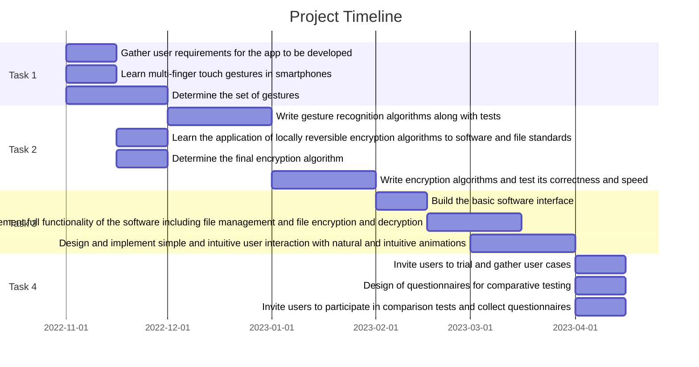

 

  

<h1 align="center">GesLock</h1>

GesLock is an Android app that protects sensitive files on mobile phones using secret multi-finger gestures.

## Features

- Intuitive password entry interaction for easy recall.
- Supports up to 11 gestures.
- Uses AES CBC PKCS5Padding algorithm for  data security.
- Fully functional document management system.
- Fully customizable user preferences.
- Silky smooth animations and fine haptic feedback.
- Adapts to system dark mode.

## Screenshots

  
  
  
  

  
  
  
  

## Support

- [GitHub Wiki](https://github.com/JerryZhangZZY/geslock/wiki)

## Work Plan (Gantt Chart)

- Task 1: To learn about the latest mobile development and in particular interactions with touch screens.

- Task 2: To design and implement an algorithm to recognize hand/finger gestures.

- Task 3: To design and implement a user interface to allow selection of user files and link it with the gesture algorithm.

- Task 4: To provide at least 3 user cases for the mobile application and compare this approach with the standard.

## Thanks

- [*@Matthew Tang*](https://github.com/wctangcse)
- [*@Tom Xia*](https://github.com/TomXia)

