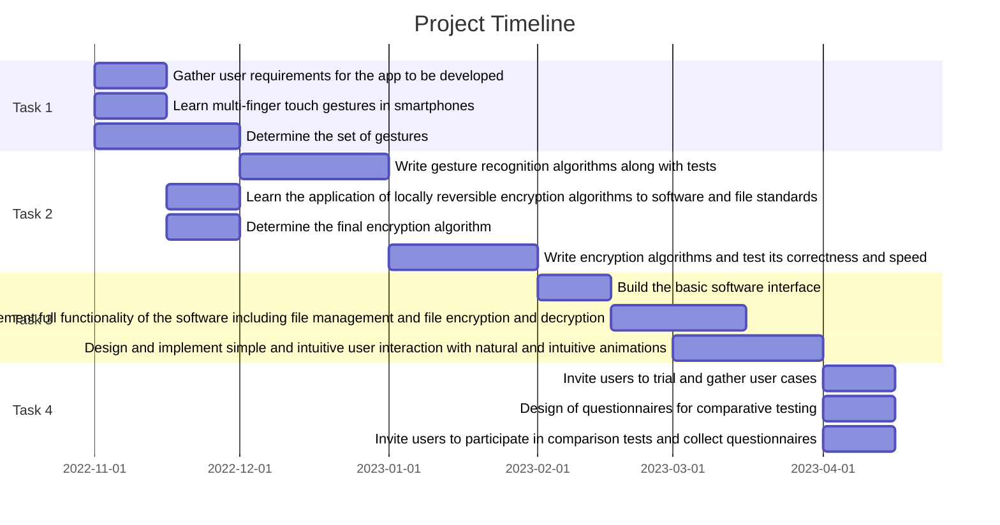

# BBC6521 Project

## Project Description

The traditional encryption method using numeric and character passwords are unintuitive, easy to forget, easy to be cracked, etc. While mobile phones nowadays are all equipped with multi-touch screens that can sense multi-finger gestures. Therefore, it is necessary to develop a mobile phone app to improve the way people encrypt sensitive files.

This project is about developing a smart phone app to protect sensitive files on mobile phones using secret hand/finger gestures.

## Work Plan (Gantt Chart)

### Task 1: To learn about the latest mobile development and in particular interactions with touch screens

### Task 2: To design and implement an algorithm to recognise hand/finger gestures

### Task 3: To design and implement a user interface to allow selection of user files and link it with the gesture algorithm

### Task 4: To provide at least 3 user cases for the mobile application and compare this approach with the standard

